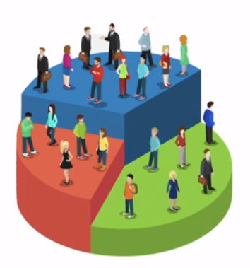

# Análise de clusters para segmentar os clientes
Este repositório contém script para fazer uma segmentação de clientes para definir a estratégia de marketing

 

# _Objetivo do projeto_

Segmentar os clientes com base em suas personalidades e identificar os fatores que mais influenciam a decisão de compra, visando direcionar os esforços de marketing de forma mais eficiente e aumentar a probabilidade de sucesso na comercialização de um novo produto.

 

# _1. Problema de Negócio_

A empresa possui um novo produto para comercializar, porém, precisa identificar o segmento de cliente mais propenso a comprar esse produto, a fim de direcionar os esforços de marketing de forma mais estratégica e aumentar as chances de sucesso.

Fonte: https://www.kaggle.com/datasets/imakash3011/customer-personality-analysis

 

# _2. Justificativa_

- **Por quê:** Compreender a personalidade dos clientes e segmentá-los de acordo com suas características permitirá que a empresa direcione suas ações de marketing de forma mais eficiente, alcançando o público-alvo adequado. Ao identificar os fatores que mais influenciam a decisão de compra dos clientes, a empresa poderá adaptar suas estratégias e mensagens para atender às necessidades e desejos de cada segmento específico.
- **Como:** Utilizando métodos de análise de clusters, como o k-means, e técnicas de análise de dados, como regressão logística e árvores de decisão, os clientes serão agrupados com base em suas personalidades e serão identificados os principais fatores que influenciam sua decisão de compra. Essas informações permitirão à empresa personalizar suas abordagens de marketing e direcionar seus esforços de forma mais eficaz para cada segmento identificado.
- **O quê:** O projeto consiste em realizar uma análise de clusters para segmentar os clientes com base em suas personalidades, além de identificar os fatores que mais influenciam sua decisão de compra. A entrega será um relatório contendo as segmentações dos clientes, insights sobre os fatores de influência e recomendações para a empresa direcionar seus esforços de marketing de forma mais eficiente. O objetivo é aumentar a probabilidade de sucesso na comercialização do novo produto, atingindo o público-alvo adequado com mensagens personalizadas e estratégias adaptadas para cada segmento identificado.

 

# _3. Premissas_

As variáveis originais do conjuto de dados são: 

Variável | Definição
------------ | -------------
ID | É uma identificação única do usuário, ou seja, não é uma característica|
Year_Birth | Ano de nascimento do cliente.
Education | Nível de educação do cliente.
Marital_Status | Estado civel do cliente.
Income | Renda familiar anual do cliente.
Kidhome | Número de crianças dentro da casa do cliente.
Teenhome | Número de adolescentes dentro da casa do cliente.
Dt_Customer | Data de cadastro do cliente na empresa.
Recency | Número de dias desde a última compra do usuário.
Complain | Se o valor for 1 indica que o usuário fez alguma reclamação nos últimos dois anos e se for zero, significa que ele não fez nenhuma reclamação nos últimos dois anos.
MntWines | Valor gasto em vinho nos últimos 2 anos
MntFruits | Valor gasto com frutas nos últimos 2 anos
MntMeatProducts | Valor gasto com carne nos últimos 2 anos
MntFishProducts | Valor gasto com pescado nos últimos 2 anos
MntSweetProducts | Valor gasto em doces nos últimos 2 anos
MntGoldProds | Valor gasto em ouro nos últimos 2 anos
NumWebPurchases | Número de compras realizadas através do site da empresa
NumCatalogPurchases | Número de compras feitas usando um catálogo
NumStorePurchases | Número de compras feitas diretamente nas lojas
NumWebVisitsMonth | Número de visitas ao site da empresa no último mês
NumDealsPurchases | Número de compras feitas com desconto
AcceptedCmp1 | Primeira campanha de promoção
AcceptedCmp2 | Segunda campanha de promoção
AcceptedCmp3 | Terceira campanha de promoção
AcceptedCmp4 | Quarta campanha de promoção
AcceptedCmp5 | Quinta campanha de promoção
Response | Mostra se ele aceitou na última

 

# _4. Planejamento da solução_

0. **ENTENDIMENTO DO NEGÓCIO**

Definição do problema: É importante definir claramente qual é o problema a ser resolvido ou a pergunta a ser respondida. É preciso entender o objetivo do projeto e a relevância do problema.

    - Descrição do negócio
    - Planejamento da solução

1. **IMPORTANDO AS BIBLIOTECAS**

Importação de bibliotecas: Nesta etapa, as bibliotecas necessárias para o desenvolvimento do modelo de machine learning são importadas. Isso inclui bibliotecas para manipulação de dados, visualização, modelagem e avaliação.

2. **COLETA DOS DADOS**

Coleta de dados: Nesta etapa, os dados são coletados a partir de diversas fontes, como bases de dados, APIs, arquivos de texto, imagens, etc.

3. **FUNÇÕES AUXILIARES**

Funções auxiliares: Nesta etapa, são criadas funções que irão auxiliar na manipulação e no processamento dos dados, na modelagem e na avaliação do modelo de machine learning. Essas funções são utilizadas em etapas posteriores do projeto.

4. **ANÁLISE EXPLORATÓRIA DOS DADOS**

Análise exploratória de dados: Nesta etapa, os dados são analisados para identificar possíveis padrões, tendências, correlações e informações relevantes que possam auxiliar na construção do modelo de machine learning. É importante entender os dados coletados, avaliar a qualidade dos dados e identificar quaisquer problemas ou limitações.

    - **Passo 1:** Análise Descritiva dos Dados
        - Esta etapa consiste na descrição estatística dos dados coletados, como média, mediana, desvio padrão, entre outros.
    - **Passo 2:** Exploração de Dados
        - Nesta etapa, os dados são visualizados e analisados graficamente para identificar padrões e relações entre as variáveis.

5. **PRÉ-PROCESSAMENTO**

Preparação de dados ou Pré-processamento de dados: Nesta etapa, os dados são limpos, transformados e preparados para serem utilizados no modelo de machine learning. Isto inclui tarefas como normalização, codificação, preenchimento de valores ausentes, remoção de outliers, etc.

6. **TREINAMENTO ALGORITMOS DE MACHINE LEARNING**

Modelagem ou Seleção do modelo: Nesta etapa, um modelo de machine learning é escolhido com base na tarefa a ser realizada e nos dados disponíveis.

7. **AVALIAÇÃO DO ALGORITMO**

Avaliação do modelo: Nesta etapa, o desempenho do modelo é avaliado utilizando métricas adequadas para o tipo de problema e modelo utilizado.

8. **INSIGHTS**

Nesta etapa, são identificadas as principais descobertas e conclusões do projeto.

 

# _5. Insights_

*Resumo dos insights durante análise exploratória de dados (EDA):*

**1º Gráfico:**

 

**Nota:**
- A maioria dos nossos clientes tem entre 30 e 50 anos. A distribuição da idade dos clientes é semelhante a uma forma de distribuição normal.

**2º Gráfico:**

 

**Nota:**
- A medida que a renda aumenta, o total gasto também tende a aumentar, principalmente acima de 60.000 dólares. Existem alguns pontos incomuns de alta renda e baixo total de pontos gastos, mas, em geral, ambos os recursos crescem juntos.

**3º Gráfico:**

 

**Nota:**
- Cerca de 29% dos clientes não têm filhos.
- 50% dos clientes tem um filho.
- 18% tem dois filhos.
- 2% dos clientes tem três.

**4º Gráfico:**

 

**Nota:**
- Vinhos e carnes são os produtos mais vendidos. Não existe informação sobre a mercearia, mas podemos pensar que esta mercearia se foca mais nos vinhos e nos produtos à base de carne, pelo que isso explicaria a comercialização da maioria dos produtos desta categoria.

**5º Gráfico:**

 

**Nota:**
- A segunda promoção foi um fracasso porque teve pouca aceitação, tendo em vista que a primeira promoção foi melhor que a segunda.
- A terceira, quarta e última promoção foram boas, em geral - Então eles aprenderam como melhorar suas promoções e influenciar mais clientes.

 

# _6. Modelos de Machine Learning_

Algoritmo não supervisionado indica que nós não temos uma classe, objetivo é não fazer previsões, mas a ideia é agrupar os dados baseado em atributos similares, por meio do cálculo da Distância Euclidiana que é uma fórmula matemática que vai medir o quanto dois pontos são parecidos, quanto mais parecidos, mas esses dados têm a tendência a pertencerem ao mesmo grupo.

1. K-Means.
2. Método de Elbow

 

# _7. Performance do Modelo de Machine Learning_

Analisando o resultado do algoritmo K-Means podemos fazer a definição do perfil dos clientes em grupos:

**Cluster 1:**
- Grupo de mais alto valor, com menor número de clientes. Além de terem uma alta renda e maior nível de educação, são os que mais compram,  com ticket médio mais alto entre todos os grupos. Não costumam visitar tanto o website da empresa, nem comprar sempre através de promoções, pois preferem as compras por catálogo e diretamente na loja. As categorias preferidas são a de carnes. A maioria não tem filhos em casa e são os clientes cadastrados há mais tempo.

ticket médio é o valor médio de cada compra.

**Cluster 3:**
- É um grupo que realiza muitas compras, porém com ticket médio bem menor que o grupo anterior, mas ainda assim trazendo bastante receita para a empresa.  Os clientes têm um salário anual relativamente alto, são mais velhos e geralmente têm 1 filho em casa. É o grupo que mais aprecia a categoria de vinhos e que tem maior número de clientes.

**Cluster 0:**
- É o cluster com clientes com menor poder aquisitivo, porém são os menos ativos dentro da empresa. A empresa precisa tomar certo cuidado, pois estão churnando e deixando de comprar como antes. Os clientes gostam de fazer compras em promoções. Gostam de visitar o website, provavelmente para buscar promoções. Também gostam de gold prods. É uma oportunidade importante para a empresa fazer campanhas de produtos mais destinados ao público infantil.

**Cluster 2:**
- É um grupo jovem, porém são os mais ativos dentro da empresa. É o grupo que se cadastrou há menos tempo. É o grupo que menos aceita as campanhas de promoção.

 

# _8. Conclusão_

Com base na análise dos clusters de clientes, foi possível identificar diferentes perfis de consumidores e suas preferências de compra. Essas informações são valiosas para direcionar estratégias de marketing e oferecer uma experiência personalizada aos clientes, aumentando a eficiência das campanhas e impulsionando as vendas.

 

# _9. Próximos passos_
Refinar os perfis dos clusters: Realizar análises mais aprofundadas dentro de cada cluster para identificar padrões de comportamento, preferências de produtos e características específicas que possam orientar estratégias ainda mais direcionadas e desenvolver campanhas segmentadas com base nos insights obtidos.
